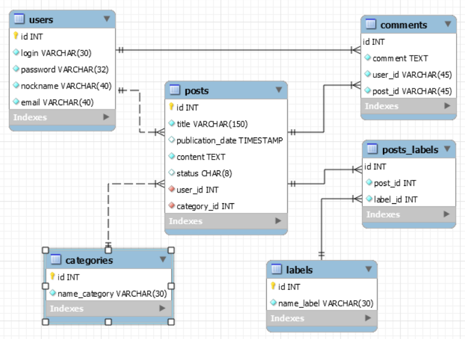
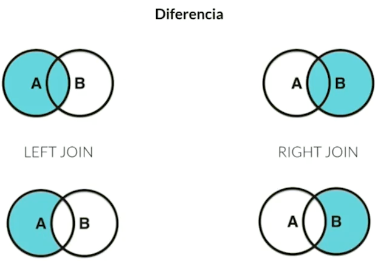

# Bases de datos

Notas tomadas del curso de fundamentos de bases de datos .

- Entidades y atributos

    Entidad fuerte: (encerrado en rectángulo) objeto que representa algo en el mundo real, se representan en plural.

    Entidades débiles: (encerrada en doble rectángulo) no pueden existir sin una entidad fuerte, son débiles por entidad (solo se diferencian por la clave de la entidad fuerte) y débiles por existencia (se les asigna una clave propia).

    Atributo: (encerrado en ovalo) las cosas que componen a la entidad.

    Atributos multivaluados: (encerrado en doble ovalo) la entidad tiene mas de uno de estos atributos.

    Atributos compuestos: (encerrado en ovalo) están compuestos de otros atributos.

    Atributos especial: (encerrado en ovalo punteado) puede ser inferida a partir de otros atributos.

    Atributo llave: (encerrado en ovalo y subrayado) identificador, identifica a la entidad de manera única.

- Relaciones

    Permiten ligar diferentes entidades, se definen a través de verbos y se representan con un rombo

    Poseen una cardinalidad para determinar el numero de entidades o atributos, pueden ser:

    - Cardinalidad 1 a 1 (linea recta a linea recta)
    - Cardinalidad 0 a 1 (linea punteada a linea recta)
    - Cardinalidad 1 a N (linea recta a linea separada en 3)
    - Cardinalidad 0 a N (linea punteada a linea separada en 3)
    - Cardinalidad N a N (linea separada en 3 a linea separada en 3)

### Pasos para realizar un proyecto:

1. Identificar las entidades
2. Pensar en los atributos

### Diagrama entidad-relación del proyecto

